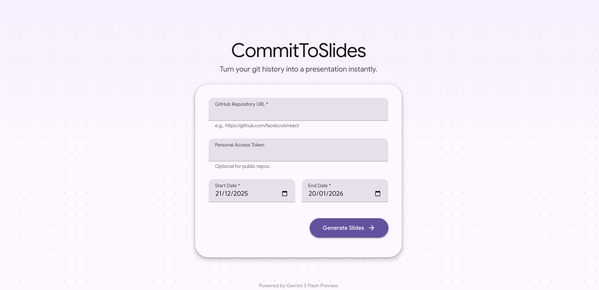
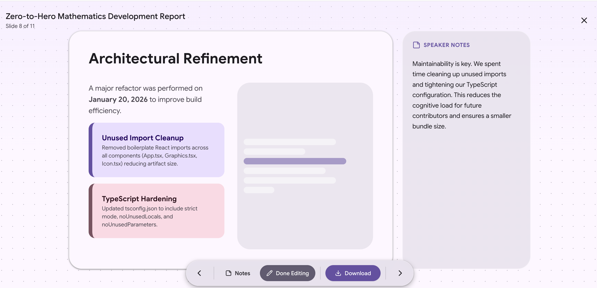

# CommitToSlides ✨ 

> **Turn your git history into a presentation instantly.**

CommitToSlides is an AI-powered tool that analyzes your GitHub repository's commit history and generates a professional, visual presentation using Google Gemini 3. It highlights your development journey, key features, and code refactors in a stunning Material Design 3 interface, ready for export to PowerPoint (.pptx).



## ✨ Features

- **AI-Driven Analysis**: Uses **Google Gemini 3 Flash** to analyze commit messages and diffs, understanding not just *what* changed, but *why*.
- **Instant Visualization**: Generates HTML/Tailwind CSS slides on the fly. No rigid templates; the AI designs the layout based on the content.
- **Deep Context**: Fetches up to 3000 characters of diff context per file to generate accurate code blocks and technical summaries.
- **Interactive Editor**:
  - **Speaker Notes**: Edit the AI-generated script for your presentation.
  - **Visual Editor**: Tweak the raw HTML/Tailwind classes of any slide directly in the app.
- **High-Fidelity Export**: Exports slides to `.pptx` by taking high-resolution snapshots of the DOM, preserving all fonts, gradients, and layouts exactly as seen on screen.
- **Material Design 3**: Built with a beautiful, modern, and accessible UI using Tailwind CSS and M3 design tokens.



## 🛠 Tech Stack

- **Frontend**: React 19, TypeScript
- **Styling**: Tailwind CSS
- **AI**: Google GenAI SDK (`@google/genai`)
- **Icons**: Lucide React
- **Export**: `pptxgenjs` & `html-to-image`

## 🚀 Getting Started

### Prerequisites

1.  **Node.js** (v18 or later recommended)
2.  **Google Gemini API Key**: Get one at [aistudio.google.com](https://aistudio.google.com/).
3.  **GitHub Token** (Optional): Required only for private repositories or to avoid low rate limits on public repos.

### Installation

1.  **Clone the repository**
    ```bash
    git clone https://github.com/yourusername/commit-to-slides.git
    cd commit-to-slides
    ```

2.  **Install dependencies**
    *(Note: This project currently uses ES Modules via CDN in `index.html` for a lightweight setup, but if you are migrating to a local bundler like Vite, install standard packages)*
    ```bash
    npm install
    ```

3.  **Configure API Key**
    Create a `.env` file in the root directory:
    ```env
    API_KEY=your_google_gemini_api_key_here
    ```

4.  **Run the application**
    ```bash
    npm run dev
    ```

## 📖 Usage

1.  Enter the **GitHub Repository URL** (e.g., `https://github.com/facebook/react`).
2.  (Optional) Enter a **Personal Access Token** if the repo is private.
3.  Select a **Date Range** (Start and End date) to analyze.
4.  Click **Generate Slides**.
5.  Review the slides, edit speaker notes, or tweak the design using the **Edit** mode.
6.  Click **Download** to get your `.pptx` file.

## 🤝 Contributing

Contributions are welcome! Please read [docs/ARCHITECTURE.md](docs/ARCHITECTURE.md) to understand the core logic before making changes.

## 📄 License

This project is licensed under the MIT License - see the [LICENSE](LICENSE) file for details.
